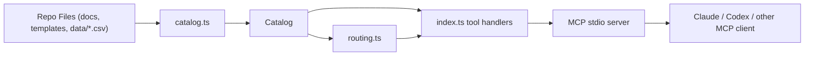

# MCP Architecture

## Goal

The MCP server turns this repository into a structured local assistant surface for public-interest civic work.

It is intentionally not a generic file browser. The design goal is:

- keep the surface grounded in curated local sources
- expose task-shaped tools rather than raw filesystem access
- make routing, contacts, and drafting support reproducible across MCP clients

## Core Modules

### `src/catalog.ts`

Responsibilities:

- load repo markdown items and CSV datasets
- normalize repo content into a single in-memory `Catalog`
- expand source-specific CSVs into a shared `ContactRow` search surface
- provide dataset and item lookup helpers

Design intent:

- keep source loading and normalization separate from ranking logic
- let new datasets be added with minimal changes to MCP tool handlers

### `src/routing.ts`

Responsibilities:

- rank issue routes and playbooks
- filter authority rows by country
- rank and annotate `find_contacts` results
- compute confidence and scope signals

Design intent:

- keep heuristics isolated from MCP transport code
- make ranking behavior inspectable and adjustable without rewriting tool handlers

### `src/index.ts`

Responsibilities:

- initialize the MCP server
- register tool schemas and handlers
- expose normalized results to MCP clients
- add packet-scope warnings and response metadata

Design intent:

- keep transport and tool registration explicit
- keep tool payloads JSON-friendly and stable

## Data Flow

## Major Design Principles

### Local-first

The server reads local repository content and returns local file paths for provenance.

### Structured over generic

The main contract is tool-level intent:

- `find_contacts`
- `route_issue`
- `get_bundle`
- `query_dataset`

not:

- raw directory browsing
- arbitrary grep over the repo

### Curated escalation support

The repo contains not only contacts but also editorial judgments such as `why_this_route`. The server should preserve those judgments rather than flattening everything into a generic search index.

### Honest uncertainty

The search layer must be able to say:

- low confidence
- out of scope
- no exact country match
- no exact audience match
- clustered result set

This is especially important for high-stakes or vulnerable-user queries.

## Extension Points

Add new source families in `catalog.ts` when:

- a new CSV or markdown dataset should become searchable
- a new public-interest contact surface should be merged into `contactRows`
- a new structured dataset deserves first-class access

Add new MCP tools in `index.ts` when:

- a workflow is common enough to deserve a stable contract
- clients would otherwise need to infer too much from generic data access

Add new ranking logic in `routing.ts` when:

- a repeated failure mode needs explicit handling
- a query class needs safer prioritization
- confidence or scope signaling needs refinement

## What Not To Do

- do not turn the server into a generic filesystem MCP
- do not hide source provenance
- do not silently widen weak or out-of-scope matches and present them as confident answers
- do not add tools that duplicate existing dataset access without a real workflow benefit
